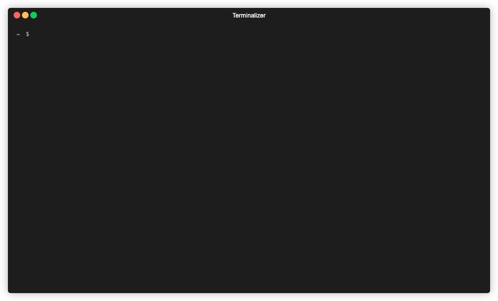

# FAA D-TPP Parser


An easy tool to parse the FAA D-TPP xml into a sqlite database and download the charts PDFs

#### References
- [FAA D-TPP](https://www.faa.gov/air_traffic/flight_info/aeronav/digital_products/dtpp/search/)


## Installation


To install the package system wide (as root):

```
pip3 install git+https://github.com/JanC/aeronav-dtpp
```

For recent `pip` versions, it is possible (and for development, recommended) to
install it to the user's home directory. By default, the binaries are in
`~/.local/bin`, which should be added to the `PATH`.

```
pip3 install --user git+https://github.com/JanC/aeronav-dtpp
```

## Usage


```
Usage: anm-dtpp [OPTIONS] COMMAND [ARGS]...

  CLI to download and process the DTPP from FAA. The script reads the latest
  FAA cycle xml and generates a sqlite DB with the PDF chart names.

Options:
  --help  Show this message and exit.

Commands:
  charts  Downloads the FAA d-TPP charts of the specific ICAO airport
  create  Reads the FAA d-TPP xml and creates a sql database from it.
  fetch   Downloads the FAA d-TPP xml.
  
```

## Examples


```bash
anm-dtpp fetch
INFO: Downloading https://nfdc.faa.gov/webContent/dtpp/current.xml
INFO: Writing xml to ./output/current.xml
INFO: Done
```

```bash
anm-dtpp create
INFO: Reading output/current.xml
INFO: Parsed 23930 charts in ./output/dtpp.sqlite
```

```bash
anm-dtpp charts --icao KSBP
INFO: Getting charts for SAN LUIS COUNTY RGNL
INFO: MIN: TAKEOFF MINIMUMS
INFO: MIN: ALTERNATE MINIMUMS
INFO: HOT: HOT SPOT
INFO: IAP: ILS RWY 11
INFO: IAP: RNAV (GPS) RWY 11
INFO: IAP: RNAV (GPS) RWY 29
INFO: IAP: LOC RWY 11
INFO: IAP: VOR OR TACAN-A
INFO: APD: AIRPORT DIAGRAM
INFO: DP: AVILA FOUR
INFO: DP: CREPE THREE
INFO: DP: WYNNR THREE
```



## Samples

A sample .xml and .sqlite are located in the [samples](samples) folder. Those contain only the charts from the KSBP airport.


## Development 

This section is meant for development tips

Running from command line

```
python3 -m anm_charts.__main__ fetch
python3 -m anm_charts.__main__ create
```